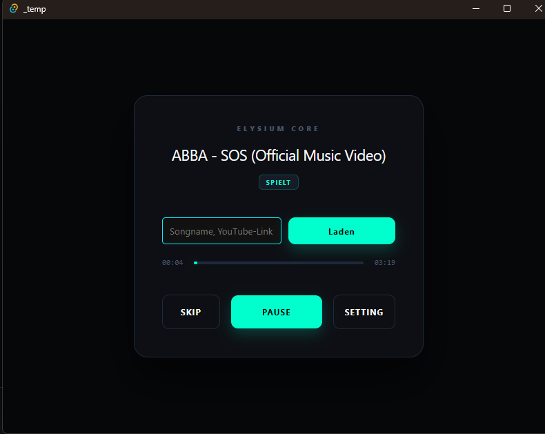
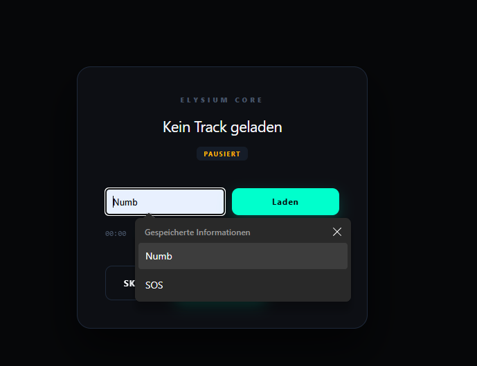

# 🎵 Elysium Music

An experimental, music player and management core built with Node.js, ui is being built with Tauri..

## ⚠️ Legal Disclaimer

This project (**Elysium Music**) is developed strictly for **educational purposes and personal hobby use**. 

- **No Media Hosting:** This repository does not host, distribute, or store any copyrighted audio files or media.
- **Third-Party Tools:** Elysium Music acts purely as an orchestrator/wrapper for existing command-line utilities like `yt-dlp`. 
- **User Responsibility:** The developers of Elysium Music do not condone, encourage, or facilitate copyright infringement. It is the sole responsibility of the end-user to ensure they have the legal right to download or stream any content accessed through this software under their local jurisdiction.
- **No Warranty:** The software is provided "as is", without warranty of any kind. Use it at your own risk.
- Programmed by a beginner with AI supported
---

## Technical Concept

I'm building this project because I really just want a more convenient solution than downloading songs and listening to them with VLC. I'm building this app so that it does this automatically for you with a management and, in addition to the downloader, a streamer that streams the song live.

## AI Disclaimer

I'm sorry, I used AI to build this project. Since I have relatively little coding experience, I try to use AI for learning and to quickly arrive at a result.

## Current state

I am currently in the process of designing the program so that it works and I can create an early alpha in a timely manner. Then you will be able to load music, listen to it, and pause. 
Of course, new features will be coming all the time! It won't just be music.